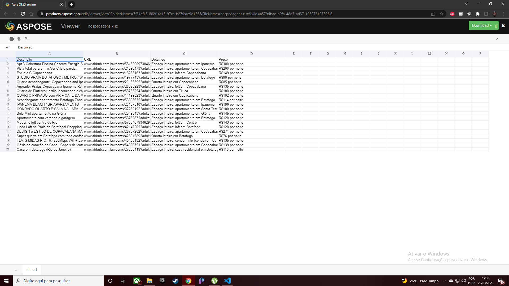

# Raspagem de dados em hospedagem

Utilizando Selenium e BeautifulSoup.

Faz uma busca de hotelaria pelo site onde coleto os dados para 2 adultos, crio uma lista mostrando as disponíveis, com descrição, localização, link para acesso e preço.

Por fim cria uma planilha em formato para Excel.

